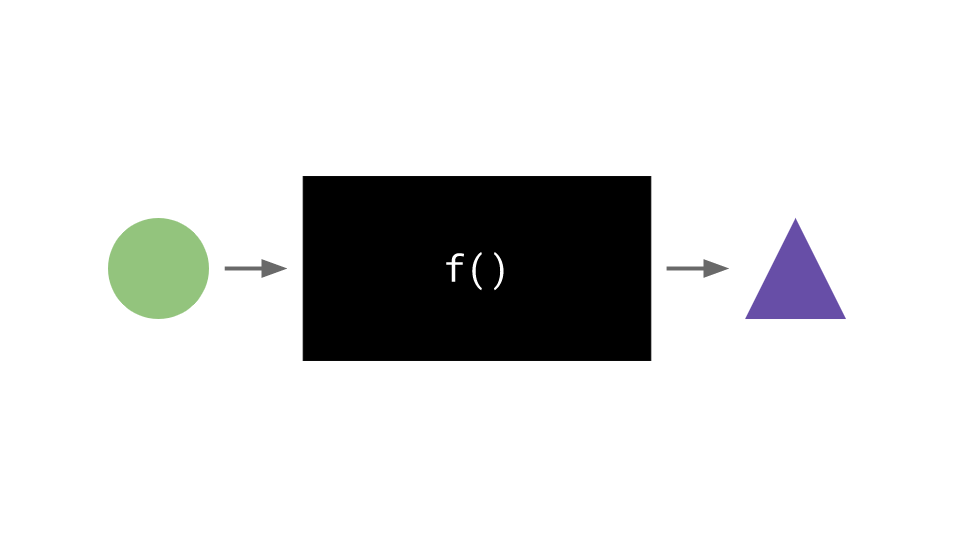
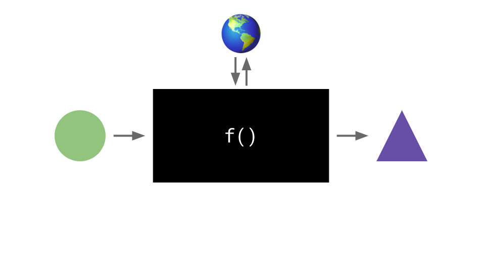
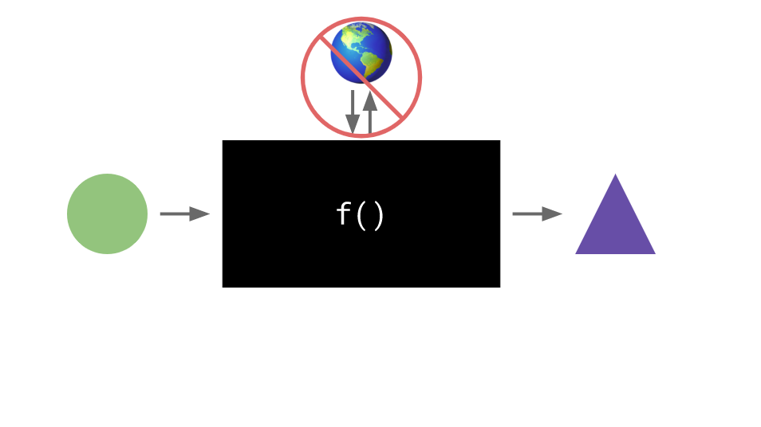

# Course: [Functional JavaScript First Steps on Frontend Masters](https://frontendmasters.com/courses/functional-first-steps/)

### Teacher: [Anjana Vakil](https://twitter.com/AnjanaVakil)

### Quick Intro:

- Core Functional Programming ideas
- We will use JavaScript
- Anjana Vakil,
  - no CS degree, instead studied philosophy & an english teacher (she's an amazing teacher btw),
  - when started working in software, different programming paradigms, different styles or mindsets for coding were super interesting (perhaps coz of philosophy background)
  - got into functional programming
  - wants to share her learnings
  - share an overview of functional programming

## What is Observable?

- It is a platform for working with code and data and visualisations, interactively live in the browser!
- it's reactive, as you enter new code, you get the rest of your programs updated instantly
- uses javascript and web technologies
- 'Notebooks'

_A fun(ctional) programming introduction by [@AnjanaVakil](https://twitter.com/AnjanaVakil) for [FrontendMasters](https://frontendmasters.com/teachers/anjana-vakil/)_

**[https://observablehq.com/collection/@anjana/functional-javascript-first-steps](https://observablehq.com/collection/@anjana/functional-javascript-first-steps)**

## **Outline**

### **[What is functional programming?](https://observablehq.com/d/5b88a355d27605eb?collection=@anjana/functional-javascript-first-steps)**

- Pure Functions vs. Side Effects
- Time, state, and (in)sanity
- Imperative vs. Declarative programming
- **[Exercise: Pure Functions](https://observablehq.com/d/f0da46a4161911f7?collection=@anjana/functional-javascript-first-steps)**

### **[Staying out of the loop with recursion](https://observablehq.com/@anjana/staying-out-of-the-loop-with-recursion?collection=@anjana/functional-javascript-first-steps)**

- Iteration vs. Recursion
- Recursive function basics
- **[Exercise: Iteration vs. Recursion](https://observablehq.com/d/89173eb291a624f6?collection=@anjana/functional-javascript-first-steps)**
- The problem with the problem with the problem with recursion

*And now, a word from our sponsors:* Tail Call Optimization

### **[Flying first-class with higher-order functions](https://observablehq.com/d/29207e3adcca9c98?collection=@anjana/functional-javascript-first-steps)**

- Functions as values
- Functions that operate on functions
- **[Exercise: Filter, Map, Reduce](https://observablehq.com/d/1d29d7170a694cb2?collection=@anjana/functional-javascript-first-steps)**

### **[Getting closure](https://observablehq.com/d/5b5fd1f7dab60e60?collection=@anjana/functional-javascript-first-steps)**

- Closures & "remembering" scope
- Partial application
- Currying
- **[Exercise: Closures & Currying](https://observablehq.com/d/d00db6d5662fa62c?collection=@anjana/functional-javascript-first-steps)**

*And now, a word from our sponsors:* The Lambda Calculus

### **[It's functions all the way down](https://observablehq.com/d/9196658711210a31?collection=@anjana/functional-javascript-first-steps)**

- Data flow
- Pipelining
- Function composition
- **[Exercise: Function Composition](https://observablehq.com/d/ad0da6f90dec5b2a?collection=@anjana/functional-javascript-first-steps)**

### **[Immutability](https://observablehq.com/d/a747566d0ed4a328?collection=@anjana/functional-javascript-first-steps)**

- Time, state, and (in)sanity, revisited
- Copying vs. Mutating
- The pitfalls of immutability
- **[Exercise: Avoiding Mutation](https://observablehq.com/d/d490533b3bbadeb3?collection=@anjana/functional-javascript-first-steps)**

*And now, a word from our sponsors:* Immutable Data Structures

### **[Recap & takeaways](https://observablehq.com/d/83b2b2efcb5839f9?collection=@anjana/functional-javascript-first-steps)**

- Review: Thinking functionally
- When is FP the right choice?

### **[Next steps](https://observablehq.com/d/21c10a6e094e87c5?collection=@anjana/functional-javascript-first-steps)**

- Further reading
- Libraries & languages to try

# What is functional programming?

- a programming paradigm (worldview/mindset)

**Some other paradigm's**
Imperative

- follow my commands
- do this, then that
- understanding the world of computing as a series of commands

Object-oriented

- imperative mindset
- keep state to yourself
- send/receive messages
- enscapulation, they can change those value overtime(state),
- they keep to themselves, but can talk to another by passing messaging,
- e.g. calling methods on other object in the program
- message passing lifestyle made up by little cellular objects (encapsulated units), and they behave by interacting with each other through messages
- [check out Anjana talk on YouTube](https://youtu.be/TbP2B1ijWr8)

Declarative

- this what I want
- do it however you want
- instead of giving a list of commands like in imperative, we say this is what I would like form you computer please.
- we let the computer figure out how to do the compuation for us
- SQL queries, you tell it what you want back, then you let it filter and sort things and work how it's gonna do that
- the idea is to move away from imperative command like way of doing things

Functional

- **one simple idea... Pure Functions**

### Some history of how Anjana learnt about this

- when she started learning she joined '[the recurse center](https://www.recurse.com/)'
- An amazing Article by [Mary Rose Cook "An Introduction to functional programming"](https://codewords.recurse.com/issues/one/an-introduction-to-functional-programming)
- Mary points out while there are all these scary terminologies and mathematical notations, it all you need to worry about is a single idea..

# Pure functions, what are they?

**only input in. only output out.**

- only takes its input in and that is the only thing, the only data that it looks at about the world, and all that it does is return its output.
- no side effects

### Thinking of only input in, only output out has some consequences

- a pure function in functional programming as kind of like a black box where you have some input like this green circle that comes in.
- And once the function has done its computation, you get some output like this blue purple triangle.



Now, when we write functions, typically day to day when we're not really thinking about what paradigm we're using, or we're not really trying to be functional programs, we're just trying to get our jobs done, or get our coding exercises done.

## Side Effects

We often write functions that look a little bit more like this where it takes some input, maybe more than one in and returns some output out.



**But it also kind of communicates with the outside world. So it also might be reading things from the outside world to help it make its computation.**

Example stuff we might reach outside for:

- what time is it?
- Or what profile picture does this user have stored on their profile,
- or what is the airspeed velocity of a swallow?

**Things like that, that aren't direct inputs to the function, but the function may be uses to do its computation.** And similarly, the function might send something back to the outside world other than its return value.

They might also:

- log a value to the console,
- or turn on a light if you're working with LEDs,
- or it might update your profile picture on some website.

Even though none of those are actually the return value, the output of the function. **That communication with the outside world that sometimes our day to day functions do, that's what we call side effects.**

## What is a side effect?

It's basically any time the function has any relation to the outside world other than through its input arguments and its return value.
**If it is doing some kind of side effect, and that is what is not allowed in a pure function.**

> So a pure function, to put it in another way is a function that does not have any side effects.

  

All it looks at, the only information it needs is whatever is passed in to it as an input, and the only thing it does in the world is return its output value.

## Every paradigm has it's advantages and disadvantages

- Just like everything in programming, in software development, it's always a matter of trade-offs.
- **Each of these paradigms has something that it can kind of teach us about how to think about the world of a program**,
- and how to conceive of the complex programs that we wanna write,
- how to break them down into smaller entities.

### Anjana advice:

> "I think that it is the best thing that we can do as programmers to learn lots of different paradigms, and to think of them as different tools in our mental toolbox, so that we can effortlessly switch between them when we need to."

"Now that is a lifelong work, that is a lifestyle that we were never done with."

This course should give us "a little bit more of an intuition of what we like about writing code in a functional style. And maybe also an intuition about times when it's not so convenient. And especially in a couple of sections from now, we're gonna get into an exercise where we're really comparing imperative and functional programming."

Some functional programming heroes to look up: Alonzo Church and Alan Turing

# Not pure vs Pure

```js
// not pure
let name = 'Alonzo'

function greet() {
  console.log(`Hello, ${name}!`)
}

greet() // Hello, Alonzo!

name = 'Alan'
greet() // Hello, Alan!
```

```js
// pure
function greet(name) {
  return `Hello, ${name}!`
}

greet('Alonzo') // "Hello, Alonzo!"

greet('Alan') // "Hello, Alan!"
```

Not pure

- name is not passed in, so it has to look for the name variable in the global scope
- and you risk getting a different output, because name is global and could changed down the road
- no input - thats kind of a yellow flag
- no return statement, which in javascript means an implicit return of undefined
- if theres no return statement it's probably doing something other than returning - so there is no output
- instead it is logging to the console, it's connecting with the outside world and thats a side effect. which is a violation of a pure function

Pure

- everytime you call it with same argument, you will get the same result
- because the result of the function doesn depend on the outside world, only the argumnets that are passed in
- deterministic

### If a pure function calls another pure function does it make it unpure?

If we know that, that inner function is pure, and that we're basically delegating some computation to it, then that doesn't necessarily mean, that we've got an impure function.

### Gotcha, A pure function, if it's not allowed to do anything in the world except return its output value, it doesn't really do anything.

I don't get any log output, I don't get my profile picture updated on the website. I don't get the light to blink if I'm working with LEDs or something like that. So I'm guessing the question is what gives?

**How do you be productive as a computer programmer without ever doing side effects? Without ever writing things to consoles or storing things in databases or updating things elsewhere? You don't.**

## How can a functional programmer be productive?

- Is to take all of those side effects.
- All of those logs, and database transactions, and inputs and outputs from the outside world.
- Push them outsideof program, so that they're kind of the very, very last step in doing any of this.
- And the inside of the program is all totally pure.

### Why would you do this?

So that anything going on inside of your program, all the logic, all of the business logic. And the computations and the manipulations of data that are usually the tricky parts of getting those programs right, all of that becomes much more easier to deal with. **Because it is more predictable, it's safer.**

And those impure side effects, we can force out to the outer edges of our program. So that we know, that, **by the time we've gotten there all of our computations have already worked perfectly the way that we want. Because everything inside the program is deterministic, as we said is a great consequence of pure functions.**

# Why Functional programming?

more predictable, safer

when you know what your output will be, your code is predictable.
Less oppurtunity for bugs
easier to test/debug
maintainable

bad reasons:

- thinking its the best. this is not the case, all paradigms have something to teach us. which we can use at differnt times depending on our needs
- makes you looks smart, or its a cool buzzword. instead think about the world of programs of computations.

it can be good for data transfers. but all the time you

## We want to make our lives easier as developers

- to understand our prgrams better
- write code thta's easier to test, easier to debug

this course focus on the ideas and no the jargon.

### object-oriented JS gets tricky - i agree

- it's hard to think about, it's hard to look at my code and understand what it's going to do
- functional programs are predictable
- Anjana prefers it, and I agree

## There is strong community

- that don't require you learn new syntax
- it has lots of resources and other learners that you can surround yourself with
- which is super important when you're learning something new

# Some guiding principles

Do everything with functions

- What are the inputs and what are the outputs
- Instead of thinking how should my program run.. we should ask function take in? and what should it put out?

### Imperative commands

```js
let name = 'Alonzo'
let greeting = 'Hi'

console.log(`${greeting}, ${name}!`)
// Hi, Alonzo!

greeting = 'Howdy'
console.log(`${greeting}, ${name}!`)
// Howdy, Alonzo!
```

### Functional

```js
function greet(greeting, name) {
  return `${greeting}, ${name}!`
}

greet('Hi', 'Alonzo')
// "Hi, Alonzo!"

greet('Howdy', 'Alan')
// "Howdy, Alan!
```

Shows 2 key inputs

- the greeting
- the name
  Output shows
- a string with the greeting & the name

## Keep remindng ourselves to avoid side effects

- Do nothing but return output
- Based on nothing but input

```js
let thesis = { name: "Church's", date: 1936 }

function renameThesis(newName) {
  thesis.name = newName
  console.log('Renamed!')
}

renameThesis('Church-Turing') // Renamed!
thesis //{name: "Church-Turing", date: 1936}
```

what are some side effects for the above code

- its console log
- thesis.name is a global variable and must be looked up, and you can't be sure it's gonna rename the correct thesis
- it would be better to pass the old and the new name in
- reassigning a global variable

refactor

```js
const thesis = { name: "Church's", date: 1936 }

function renameThesis(oldThesis, newName) {
  return {
    name: newName,
    date: oldThesis.date,
  }
}

const thesis2 = renameThesis(thesis, 'Church-Turing')
thesis
thesis2
```

- **we are creating a new object and returning**
- we don't want to update things in place
- we want to take the old thing and make a new slightly different version which we then return in it's place

### Arity means the number of arguments the function takes in

# Recursion

- it helps us avoid a more imperative style of looping

Iterating and Recursion:

- are sorts of mini paradigms that go together with imperative and functional programming
- get the computer to do the same operation, lots of different times

## Iteration

- imperative
- looping: repetition in terms of loops. for or while
- stateful: the values changing overtime
- isn't functional

```js
function sum(numbers) {
  let total = 0
  for (i = 0; i < numbers.length; i++) {
    total += numbers[i]
  }
  return total
}

sum([0, 1, 2, 3, 4]) // 10
```

## Recursion

- functional
- self-referential: function calls itself from within itself. which is how execute the same operation mutliple times
- stateless: we only care about the input & output
- it makes a call to itself

```js
function sum(numbers) {
  if (numbers.length === 1) {
    // base case
    return numbers[0]
  } else {
    // recursive case
    return numbers[0] + sum(numbers.slice(1))
  }
}
sum([0, 1, 2, 3, 4]) // 10
```

### Must haves for recursive functions

- function must have 2 parts: recursive case & base case
- base case stops us from getting stuck in an infinite loop
- you can have more than one base case. but you must have at least one all you stay in the resursion forever
- we should think about what are the performance implications for recursive functions vs iterators

**Studying basic math can help you understand recursive functions better**

Strongly typed data works really well with functional programming.

```js
function iterativeFibonacci(n) {
  if (n === 0) return 0
  if (n === 1) return 1

  let previous = 0
  let current = 1
  for (let i = n; i > 1; i--) {
    let next = previous + current
    previous = current
    current = next
  }
  return current
}

function recursiveFibonacci(n) {
  if (n === 0) return 0 // set first two numbers (2 part base case)
  if (n === 1) return 1 // set first two numbers (2 part base case)
  return recursiveFibonacci(n - 2) + recursiveFibonacci(n - 1)
  // recursive case. we get the number 2 before and the number 1 before so we can add them together and get the current fibonacci number.
  // this is more similar to what we see in maths.
}
```

## Performance

- the imperative fibonacci appears to perform much faster than the recursive fibonacci

why is recursive function slower?

- it is making the same call with the same arguments repeatedly
- it's using the callstack

There are 2 problems recursive functions

- doing the same work multiple times. one solution is called Memoisation. it's a way of caching the functions
- too much recursion/call stack exeeded/ stack overflow

## Anjana explains the call stack

Every time I call a function in JavaScrip, I have to add a new frame for that exact call of the function to what's called the functions to the `call stack`.

- **The call stack is on my computer and my computer has a finite amount of memory.**
- We're trying to do a operation recursion which could theoretically go on forever.
- There's nothing conceptually or mathematically preventing that recursion from going, going, going,...
- However, we're doing that **potentially infinite operation in a finite resource environment.**

- If we keep adding frames to the stack, eventually we have a really, really deep recursion because I've got a big input number or I've got a large array I'm operating on or something like that.
- I'm gonna run out of room and so I'm gonna get this error call stack size exceeded or too much recursion or whatever my browser tells me.

### The solution

- Or a solution to that is something called tail recursion and tail call optimization.

- TLDR is that tail call optimization is a feature of some runtimes (like my JavaScript engine), where it can perform an optimization on my recursive code, if, I write that recursive code in a particular way.

Instead of writing a regular recursive function, I write something that's called a tail recursive function.
[Check out the Natalia Margolis and Anjanas musical tech talk about it.](https://www.youtube.com/watch?v=-PX0BV9hGZY&ab_channel=Confreaks)

### Proper tail calls

- Javascript introduced in ES6 or ES2015 `proper tail calls`
- allows you to in certain engines, like Safari, for example,
- you can take advantage of this tail call optimization thanks to the language feature proper tail calls that was added in ES6.

Read up on how to get around functional performance issues. In functional languages you see that kind of thing built into the language so that you don't have to worry about it. **Because JS is multi-purpose language we have to think a bit more about performance.** Infact JS had to change to make those workarounds possible.

It tool the functional programming community a really long to time to solve these kinds of issues. To work out how to combine recursive & pure function way of solving problems (functional mindset), with the constraints of working with a computer architecturethat is limited with its resources.
